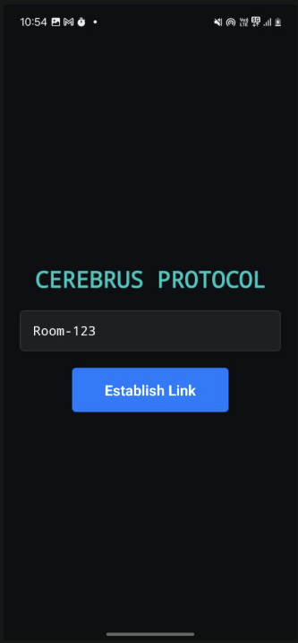
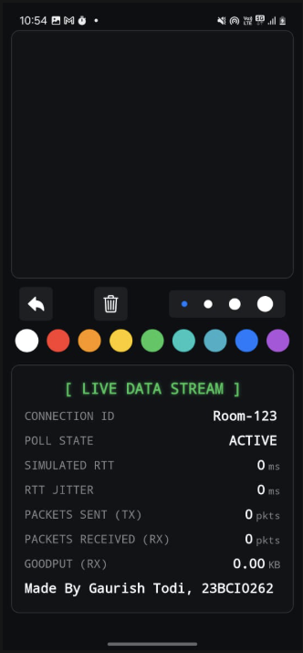
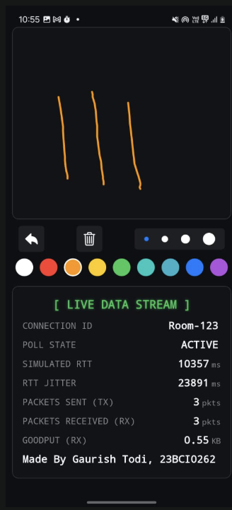
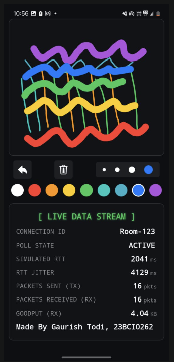

# 🚀 Cerebrus Protocol: An Advanced, Cloud-Native Real-Time Collaborative Whiteboard


Cerebrus is a full-stack, real-time collaborative whiteboard application engineered to explore and solve complex networking challenges inherent in modern mobile applications. This project deliberately rejects conventional solutions like WebSockets to architect a more resilient, universally accessible system.

The core of the project is a **custom application-layer transport protocol** built on **HTTP Long Polling**, ensuring robust performance even on restrictive corporate or university networks where other real-time protocols fail. The system is a practical demonstration of a sophisticated, cloud-native architecture, integrating a high-performance **Python (FastAPI)** backend with a polished **React Native** mobile client, all monitored via **Google Cloud Platform (GCP)**.

---
## 🌟 Application Showcase

The Cerebrus UI is designed as a "mission control" for real-time collaboration, providing not only advanced drawing tools but also a live dashboard of the underlying network's performance.

| Connection Screen & Lottie Animation | Main Whiteboard UI |
| :---: | :---: |
|  |  |
| **Advanced Drawing Toolbar** | **Live Network Stats Panel** |
|  |  |

---
## 🧠 Core Computer Networks Concepts Implemented

Cerebrus is a tangible implementation of several advanced networking principles, engineered at the Application Layer to overcome the limitations of the Transport Layer.

### 1. Custom Flow Control Mechanism

**Concept:** Flow control is essential to prevent a fast sender from overwhelming a slower receiver.

**Implementation:** The Cerebrus protocol implements a **user-action-based transmission rate**. Data "packets" (HTTP `POST` requests) are only sent upon the completion of a user action (lifting a finger after drawing a stroke). This naturally meters the flow of data, preventing the client from flooding the server and ensuring that the application's network traffic is proportional to the user's activity. This is a simple yet highly effective form of flow control perfectly suited for this use case.

### 2. Custom Error Control Mechanism

**Concept:** Error control guarantees that data arrives reliably and in the correct order, with mechanisms to handle data loss.

**Implementation:** The HTTP Long Polling architecture provides multi-faceted error control:
* **Guaranteed Delivery:** Built on top of TCP, every `POST` request for drawing data is inherently reliable. The client receives a definitive success or failure status, eliminating the "fire-and-forget" uncertainty of UDP.
* **Ordered, Gap-Free Delivery:** This is the most critical part. The server assigns a unique, monotonically increasing `id` to every message. The client tracks the `last_message_id` it has successfully received and perpetually polls for messages *after* that ID (`/api/poll/room123/15`). This creates a stateful, ordered data stream over the stateless HTTP protocol, ensuring that no drawings are ever lost or received out of sequence.

### 3. Application-Layer Protocol Design

Cerebrus is a custom Layer 7 protocol with its own defined rules and message formats (JSON payloads) running over HTTP. It demonstrates how to build sophisticated, stateful interactions on top of the web's fundamental request-response model.

---
## 🏗️ Architecture & Technology Stack

The system is architected as a modern, decoupled three-tier application, showcasing a professional separation of concerns and a powerful, cloud-ready technology stack.

```mermaid
graph TD
    subgraph "User's Device"
        A["React Native Client App
(Expo Dev Client)"]
    end

    subgraph "Development Tunnel"
        B["ngrok Secure Tunnel"]
    end

    subgraph "Application Server (GCP-Ready)"
        C["Python FastAPI Backend
(Modular: Routers, Services, Schemas)"]
    end

    subgraph "Cloud Database (GCP)"
        D["Firebase Firestore
(Real-Time Logging)"]
    end

    A -- "HTTP POST (Draw Data)" --> B
    A -- "HTTP GET (Long Poll)" --> B
    B -- "Forwards Traffic" --> C
    C -- "Writes Logs" --> D
